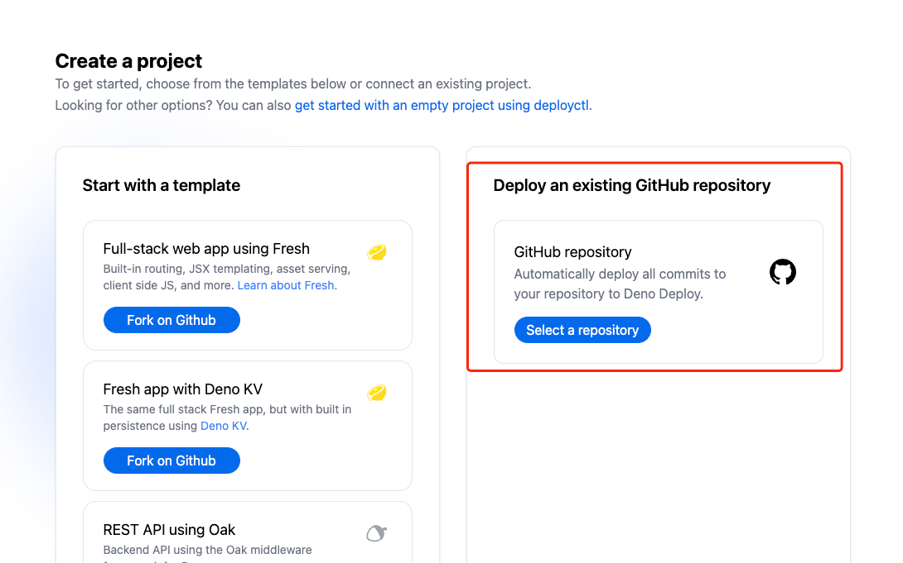
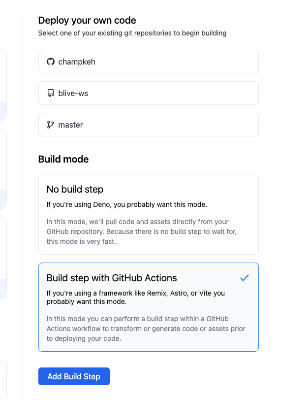
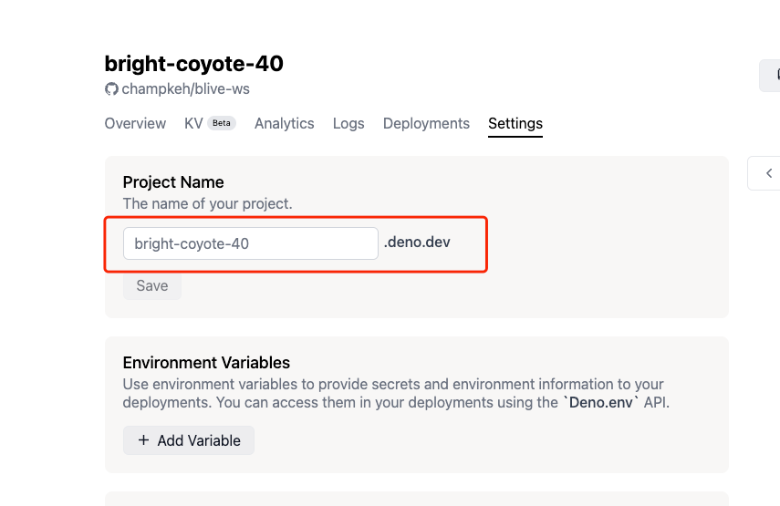

# blive-ws

B站直播间 WebSocket 代理服务，可用于实时获取直播间弹幕相关数据。

> 关于这个代理服务，可查看 [websocket重构](docs/refactor.md) 了解更多细节。

演示地址: https://blive.deno.dev

> ⚠️⚠️⚠️
> 
> 上面这个演示地址采用的是 **公共代理** 服务，这个服务是部署在免费的 [Deno Deploy](https://deno.com/deploy) 上面的，**稳定性不能保证，仅用于演示的目的**。
> 
> 如果需要使用，请 **自行部署**。


## 部署指南

> 目前仅支持部署到 [Deno Deploy](https://deno.com/deploy)，请自行注册账号。如果需要部署到其他平台，欢迎PR。

### 部署到 Deno Deploy

#### 1. fork本仓库

#### 2. 在 Deploy 上创建项目
选择 **Deploy an existing GitHub repository**，如下图所示：


#### 3. 项目配置 & 部署
选择刚 fork 的仓库及分支，构建模式选择 **无需构建**，入口文件选择 **src/deno/app.ts**，然后点击 **创建&部署**，如下图所示：


#### 4. 获取代理地址
恭喜你，到这一步，就已经部署成功了。

切换到 **设置** 选项卡下面获取 ws 地址，如下图所示，ws 地址为：`wss://bright-coyote-40.deno.dev`




## 使用指南

通过在服务端部署一个 websocket 代理服务器，这个代理服务器与B站的弹幕服务器进行通信并封装了繁琐的通信细节及服务轮训过程，前端只需要连接到这个代理服务器，然后通过几条简单的指令即可开启实时弹幕接收了。

> 下面的示例是浏览器 js 代码，其他环境类似，都是通过 websocket 客户端连接到这个代理服务器，然后发送指令。
> 
> 目前的公共代理服务器地址为: [wss://blive.deno.dev](https://blive.deno.dev)

```js
// 连接到代理服务器
const socket = new WebSocket('wss://blive.deno.dev')

socket.addEventListener('open', () => {
    // 进入房间命令
    socket.send(JSON.stringify({
        cmd: 'enter',           // 命令名，必填
        rid: 123,               // 房间号，必填
        events: ['DANMU_MSG'],  // 监听这个房间中的事件列表，必填
    }))

    // 退出房间命令
    socket.send(JSON.stringify({
        cmd: 'leave',           // 命令名，必填
        rid: 123,               // 房间号，必填
    }))
    
    // 退出所有房间
    socket.send(JSON.stringify({
        cmd: 'exit',
    }))
})

// 接收进入房间时`events`参数所指定的消息
socket.addEventListener('message', ({data}) => {
    // 接收到的消息，格式为 { rid: 房间号, payload: {} }
    console.log(data)
})
```
> 更详细的例子，请查看 [Example (JS版)](examples/example.js)

### 支持的命令 cmd

- `enter`: 进入房间，需要传 rid 和 events 参数
- `leave`: 退出房间，需要传 rid 参数
- `exit`: 退出所有房间

### 支持的监听事件 event

> 注：本人不怎么玩直播，所以下面的事件名字都是根据英文单词直译的，可能跟大家在直播间使用的术语不一样。

|          事件名(大小写敏感)           |     说明      |
|:-----------------------------:|:-----------:|
|     COMMON_NOTICE_DANMAKU     |    公共通知     |
|          NOTICE_MSG           |    任务通知     |
|      STOP_LIVE_ROOM_LIST      |   停播直播间列表   |
|       HOT_RANK_CHANGED        |    热榜更新     |
|      HOT_RANK_CHANGED_V2      |    热榜更新     |
|    HOT_RANK_SETTLEMENT_V2     |    热榜结算     |
|           DANMU_MSG           |    普通弹幕     |
|       DANMU_AGGREGATION       |    聚合弹幕     |
|      SUPER_CHAT_MESSAGE       |   超级聊天消息    |
|    SUPER_CHAT_MESSAGE_JPN     |   超级聊天消息    |
| ROOM_REAL_TIME_MESSAGE_UPDATE |  直播间实时信息更新  |
|         INTERACT_WORD         |   直播间互动文字   |
|        WATCHED_CHANGE         |  直播间观看人数更新  |
|        ONLINE_RANK_V2         |  直播间高能用户排名  |
|       ONLINE_RANK_COUNT       |  直播间高能用户数   |
|       ONLINE_RANK_TOP3        | 直播间Top3高能用户 |
|         ENTRY_EFFECT          |    进入特效     |
|           GUARD_BUY           |    购买舰长     |
|           SEND_GIFT           |     送礼物     |
|          COMBO_SEND           |    连送礼物     |
|             LIVE              |    开始直播     |
|           PREPARING           |     准备中     |
|       PK_BATTLE_PRE_NEW       |     PK      |
|         WIDGET_BANNER         |     小部件     |
|     LIVE_INTERACTIVE_GAME     | 现场交互游戏(弹幕？) |

### 使用注意事项
```js
/**
 * 数据流转图示:
 *               1                          2
 * 客户端(you)   <==>   代理服务器(本服务器)   <==>   B站弹幕服务器
 *
 */
```
由于 ws 连接需要保活，所以需要心跳机制，该机制通常是通过 ping/pong 帧实现的，
但是由于 ws 库的原因，无法发送这两个数据包，所以代理服务器会每隔20秒给客户端
发送一个 `heartbeat` 字符串作为 ping 帧，客户端不再需要自己发送 ping 帧来
保活，但是需要处理这个 `heartbeat` 消息。

比如，如果JSON解析失败则忽略之(因为正常的消息都是JSON字符串)：
```js
ws.onmessage = (event) => {
    let data
    try {
        data = JSON.parse(event.data)
    } catch (e) {
        return
    }
    
    // 后续的处理
}
```


## 目录说明

下面是本项目各个目录的说明：

- anatomy: 对B站压缩版js进行还原，也可能会把一些文件拆成多个文件方便分析
- apps: 基于这个服务所做的一些demo(即将被废弃)
- docs: 项目文档及一些收集到的B站网页调用的接口
- examples: 使用示例
- raw: 从B站获取的压缩版js文件(原始未修改)
- src/deno: 部署到 Deno Deploy 的代理服务器
- test: 测试文件


## 通讯协议细节
[B站直播间数据传输协议细节](docs/ptotocol.md)

## FAQ

### 1. 为什么会有这个项目？
周末在家刷B站时，偶尔看到B站直播间可以用弹幕玩游戏，根据用户输入的弹幕内容与其他玩家进行实时游戏，感觉挺新颖的，于是就想研究一下是怎么实现的。

网上大概搜了一下，<del>B站没有提供实时获取直播间弹幕的 API</del>(B站提供了开放直播相关的sdk，不过需要繁琐的鉴权过程，于是放弃)，网上有使用爬虫实现的，但作为一枚前端，首先想到的就是看看能不能直接连接B站的 websocket 弹幕服务器，直接接收弹幕消息。

想法有了，于是就开干吧。整个过程其实就是把B站的直播间相关js代码拉下来，然后将压缩版的js代码还原成接近源码的程度，弄清楚整个 websocket 是如何通信的。

这个过程其实没那么难，只是需要花一些时间。利用周末2天时间，基本上把弹幕的接收端调通了，可以实时接收直播间的弹幕消息。

> 目前遇到的难点可能就是 await 代码不太好还原成源码，基本只能靠猜。因为 await 编译之后变成了 generator 的实现，中间的逻辑我还没分析出来。
>
> 不过，单靠猜基本也能还原个八九不离十。
>
> 感兴趣的可以查看下 anatomy/await/ 目录下关于`__awaiter/__generator`函数的实现。

### 2. 与官方 sdk 相比，有什么优缺点？
> 说实话，在开始这个项目之前我是不知道（也没有想到，的确是我考虑不足）有官方 sdk 的。 后面发现官方提供了直播相关的开放平台（https://open-live.bilibili.com/document/）, 不过对接这个sdk需要繁琐的鉴权过程，如果只需要获取弹幕数据的话，可以直接使用本工具。(后续会研究一下官方sdk的其他功能)

优点：
- 使用简单

缺点：
- 等我研究完官方sdk后进行说明（但很明显的缺点就是功能单一，无法与其他直播间相关功能进行整合）

### 3. 与其他类似开源项目相比，有什么优缺点？
首先，最大的优点就是 **语言无关**，也就是说，不管是浏览器、node、Java 还是 python，都可以使用本项目（毕竟它只是一个服务而已）。另外，**使用简单** 也是它的另一个优点。

缺点的话，首先是 **需要服务器** 进行部署，但好在有一些免费的服务器可以使用，所以这一点并不算很严重的缺点。
另一个缺点可能有 **速度上的劣势**，毕竟中间多了一层服务转发，这个跟服务器的位置及流量、性能等有关，具体会多出来多少延迟我没有统计过。


## 类似项目

- [B站API收集](https://github.com/SocialSisterYi/bilibili-API-collect)
- [B站直播API收集](https://github.com/lovelyyoshino/Bilibili-Live-API)
- [bilibili-live-ws](https://github.com/simon300000/bilibili-live-ws)
- and more（就不一一列举了）


## TODO
近期要实现的功能：

- [ ] 添加稳定性测试


## LICENSE

MIT
